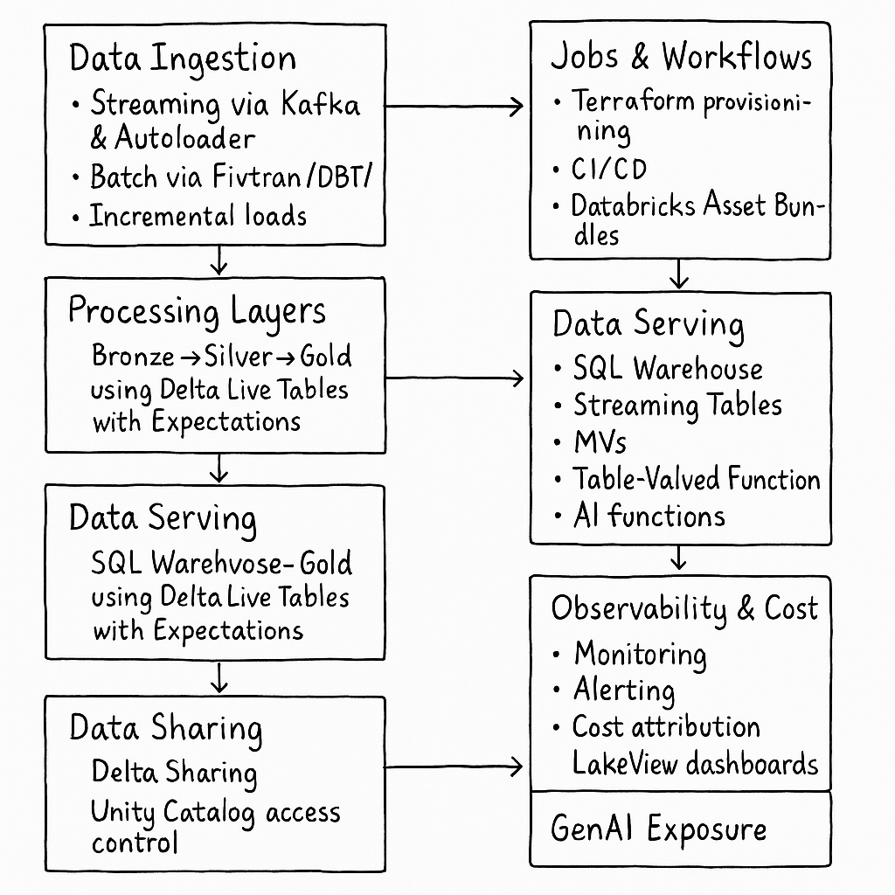

# Customer 360 Lakehouse on Databricks

This project is a Customer 360 Data Platform for a fintech lending company using Databricks Lakehouse architecture. It supports ingestion, transformation (DLT), SQL analytics, ML scoring, and open data sharing with Delta Sharing.


---

##  Architecture Overview



**Key Components:**
The architecture follows a modular and layered approach:
- **Ingestion**: Kafka & Autoloader (streaming), Fivetran/DBT/APIs (batch)
- **Processing**: Bronze → Silver → Gold layers using Delta Live Tables with data quality Expectations
- **Modeling**: Delta Lake with ZORDER, Liquid Clustering, Predictive Optimization, Deletion Vectors
- **Serving**: SQL Warehouse, TVFs, MVs, AI functions
- **ML Engineering**: MLFlow, Feature Store, Model Registry for credit scoring
- **Data Sharing**: Delta Sharing with Unity Catalog controls
- **DevOps & Infra**: Terraform, Databricks Asset Bundles, CI/CD
- **Observability & Cost**: LakeView dashboards, Monitoring & Alerting
- **GenAI Exposure**: LLM-powered chatbot over customer risk data

---

##  Project Structure
```
Customer360-Databricks/
├── architecture.png
├── README.md
├── data/
│   ├── customer.csv
│   └── transaction.csv
├── pipelines/
│   └── dlt_pipeline.py
├── infra/
│   ├── main.tf
│   ├── variables.tf
│   └── outputs.tf
├── sql/
│   ├── streaming_table.sql
│   ├── tvf.sql
│   └── mv.sql
├── ml/
│   └── credit_model.py
├── .gitignore
├── bundle.yml
```

##  Tools & Technologies
- **Databricks** (DLT, SQL Warehouse, MLFlow, UC)
- **Python**, **SQL**, **Terraform**
- **Delta Lake**, **Autoloader**, **Fivetran**, **DBT**, **Kafka**
- **ML Libraries**: Scikit-learn

---

## Implementation Workflow

### 1. **Data Ingestion**
- Used Autoloader to simulate streaming ingest of `customer.csv` and `transaction.csv`

### 2. **DLT Pipeline** (`dlt_pipeline.py`)
- Bronze: Raw load from Autoloader
- Silver: Cleaned and validated with DLT Expectations
- Gold: Aggregated summary of customer spend

### 3. **Delta Optimizations**
- Applied `ZORDER` and design-ready for clustering, delete vectors

### 4. **Asset Bundle**
- `bundle.yml` defined to deploy DLT pipeline with Unity Catalog targets

### 5. **SQL Layer**
- `streaming_table.sql`, `tvf.sql`, and `mv.sql` demonstrate serving logic using SQL Warehouse

### 6. **ML Pipeline**
- `credit_model.py`: Logistic Regression model trained & tracked with MLFlow

### 7. **Terraform Infra**
- Defined catalog, schema, and pipeline using `main.tf`, `variables.tf`, `outputs.tf`

## Key Highlights
| Feature 			| Implementation 								|
|--------			|-----------------|
| Ingestion 		| Kafka, Autoloader, Fivetran-style batch 		|
| DLT Layers 		| Bronze → Silver → Gold with expectations 		|
| Delta Lake 		| ZORDER, Clustering ready, Deletion vectors 	|
| SQL Serving 		| TVF, MV, Streaming Table 						|
| Infra as Code	 	| Terraform + Databricks Asset Bundles 			|
| ML & MLOps 		| MLFlow model with metrics logged 				|
| GenAI 			| Designed for chatbot on customer risk data 	|
| Cost & Monitoring | LakeView compatible, modular setup 			|

---

##  How to Run

### 1. Prerequisites
- Databricks Workspace on Azure or AWS
- Unity Catalog enabled
- Databricks CLI configured
- Terraform installed locally

### 2. Provision Infra (Optional)
```
cd infra
terraform init
terraform apply -var="databricks_host=<your-host>" -var="databricks_token=<your-token>"
```

### 3. Deploy with Asset Bundle
```
cd ..
databricks bundle deploy
```

### 4. Run DLT Pipeline
```
databricks bundle run
```

### 5. SQLWarehouse Execution
Run the SQL files under `/sql/` via Databricks SQL editor or CLI:
- `streaming_table.sql`
- `tvf.sql`
- `mv.sql`

### 6. Train ML Model
```
cd ml
python credit_model.py
```

---

## Evaluation Highlights
| Area | Features Included |
|------|--------------------|
| Delta Optimizations | ZORDER, DLT Expectations |
| Streaming & DLT | Autoloader + Bronze → Gold |
| SQL | TVF, MV, Streaming Table |
| Unity Catalog | Catalog + Schema via Terraform |
| DevOps | Terraform, Asset Bundle |
| MLFlow | Logistic Regression + Tracking |
| Observability | Compatible with LakeView Dashboards |

